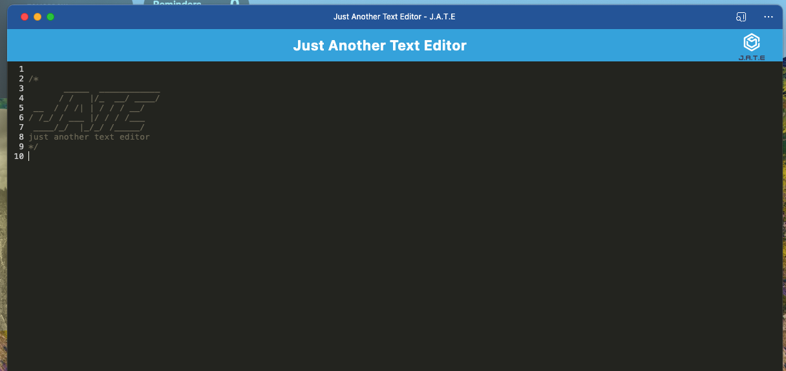

# Just Another Text Editor (J.A.T.E)

JATE is a Progressive Web Application Text Editor that is JavaScript aware. It leverages modern web application technology to provide a robust and responsive application that is fully functional even when there is no connection to the Internet.Additionally, it features a number of data persistence techniques that serve as redundancy in case one of the options is not supported by the browser.

## Features

- **indexedDB content store:** Leverages local cache to store and retrieve data.

- **webpack:** Source code bundling for easier deployments.

- **workbox:** Create service workers to cache static assets and improve performance.

- **babel:** For backwards compatibility with browsers no one uses.

- **installable:** Can be installed as a Progressive Web App

## Screenshot

## Getting Started

JATE is an online application and can be accessed at: https://jate-server.onrender.com/

## Contributing

We welcome contributions from the community to enhance and improve JATE. To contribute, please follow these guidelines:

- Fork the repository and create a new branch for your feature or bug fix.
- Ensure your code adheres to the coding standards and conventions used in the project.
- Submit a pull request with a clear description of your changes and the problem they solve.

## Support

If you encounter any issues or have any questions or suggestions, please don't hesitate to reach out to our support team at support@JATE.com. We're here to help!

## License

JATE is licensed under the MIT License. See the [LICENSE](LICENSE) file for more information.

## Application Repository
https://github.com/stephen-scheiman/jate

## Application Hosted on Render
https://jate-server.onrender.com/

